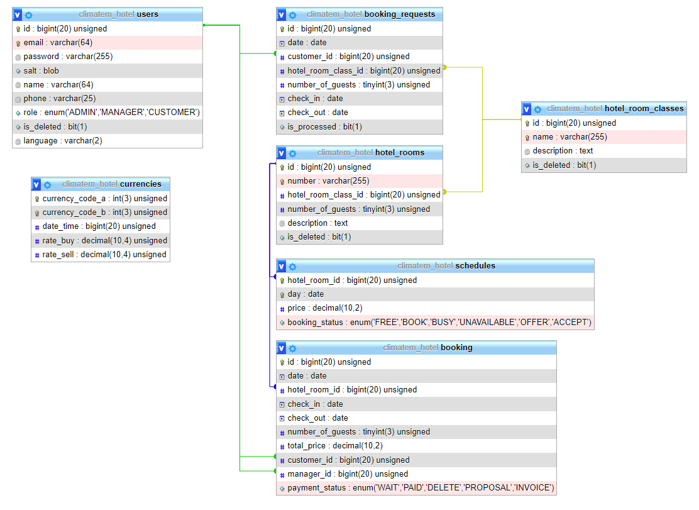

# Hotel-app

A Java web application with a user interface (Bootstrap) that simulates the administration of a hotel.

- Implemented. Customer registration - for all visitors.
- Implemented. Manager registration - admin only.
- Implemented. Authorization and separation of access rights depending on the user's role.
- Implemented. Personal account. Change of credentials. Change password with confirmation. For registered users.
- Implemented. Deleting your own account - only for customers and managers. For an account with the Admin role, the function is not available.
- Implemented. Adding, deleting, changing the classes of hotel room. Only for Manager and Admin roles.
- Implemented. Adding, deactivating, activating hotel rooms. Only for Manager and Admin roles.
- Implemented. Batch addition of available reservation days with prices for weekdays and weekends. With indication of the current occupancy status of the rooms. Only for Manager and Admin roles.
- Implemented. User list management. User with the Admin role can manage all users. For a user with the Manager role - only customers. Sorting by parameters. Pagination.
- Implemented. Sending a request for a reservation indicating the dates of arrival and departure, the class of hotelRooms, the number of guests. View a list of all customer requests. Deletion of requests not processed by Managers. A user with the role Customer.
- Implemented. Get a list of requests from all customers. Filter by Request status. Pagination.
- Implemented. Automatic selection of the list of hotel rooms according to the request parameters. Sending for confirmation the hotel room selected by the manager, indicating the total amount and automatically filling in the status of the hotelRoom status Offer and creating a reservation object with the Proposal status. sending an e-mail that the booking for this request is not possible. The status of the reservation request is changed to processed. For users with the roles Manager or Administrator.
- Implemented. Proposal acceptance confirmation. Change the status of the reservation object to Wait. For users with the Customer status.
- Implemented. Confirmation of the transfer of the reservation object for payment to the Customer. For users with the roles Manager or Administrator.
- Implemented. Imitation of payment by the client. The first option is a payment by click. The second option is to download the PDF file with the invoice.
- Implemented. Sending an invoice by email.

## Technology
- Java 11
- Java Servlet API
- Java Database Connectivity (JDBC)
- MySQL
- JSON
- Maven
- Tomcat
- PDFBox

## How to run
- Fill real variables names to db_sql.properties.
- Initialize DB using init_db.sql file.
- Configure Tomcat
- Launch the project

